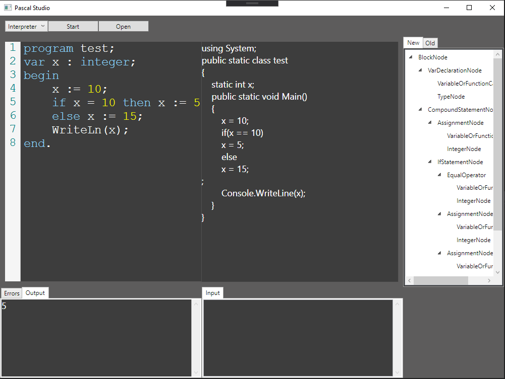
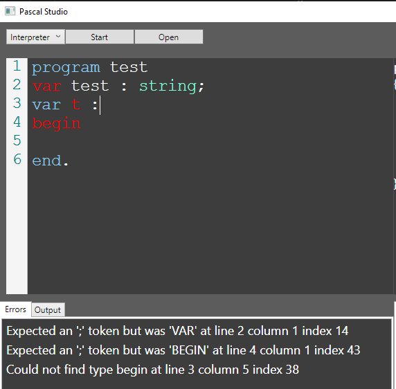

## Compilers

This is a project that tests compilers.  It has a pascal IDE that converts pascal code into c#

## IDE

### Resources
Below are some of the resources I used.  Hopefully these can give you some pointers on building your own stuff!
https://www.tutorialspoint.com/compiler_design/compiler_design_quick_guide
LLVM with compilers
https://gnuu.org/2009/09/18/writing-your-own-toy-compiler/

Using ANTLR with c#
https://tomassetti.me/getting-started-with-antlr-in-csharp/

68000 assembler ide
http://www.easy68k.com/

68000 assembler tutorial
http://mrjester.hapisan.com/04_MC68/Sect01Part01/Index.html

Pascal tutorial
https://compilers.iecc.com/crenshaw/tutor2.txt

{Source code here: https://compilers.iecc.com/crenshaw/tutor2.txt}  
{You can test the code here: https://www.tutorialspoint.com/compile_pascal_online.php}  
{Amazing resources: https://stackoverflow.com/questions/1669/learning-to-write-a-compiler}  
{Best tutorial for pascal interpreters: https://ruslanspivak.com/lsbasi-part14/}  

Compile c#
https://www.c-sharpcorner.com/article/how-to-run-and-excute-c-sharp-program-using-in-notepad/

Compile c# using command prompt
https://stackoverflow.com/questions/553143/compiling-executing-a-c-sharp-source-file-in-command-prompt

Using the CodeDom with roslyn
https://docs.microsoft.com/en-us/dotnet/api/microsoft.csharp.csharpcodeprovider?view=netframework-4.8

## Blazor

Js Interlop
https://blazor-university.com/javascript-interop/calling-dotnet-from-javascript/

Code Editor
https://ace.c9.io/#nav=howto
